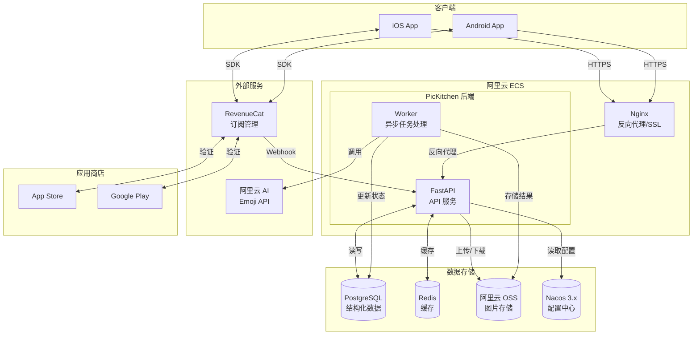
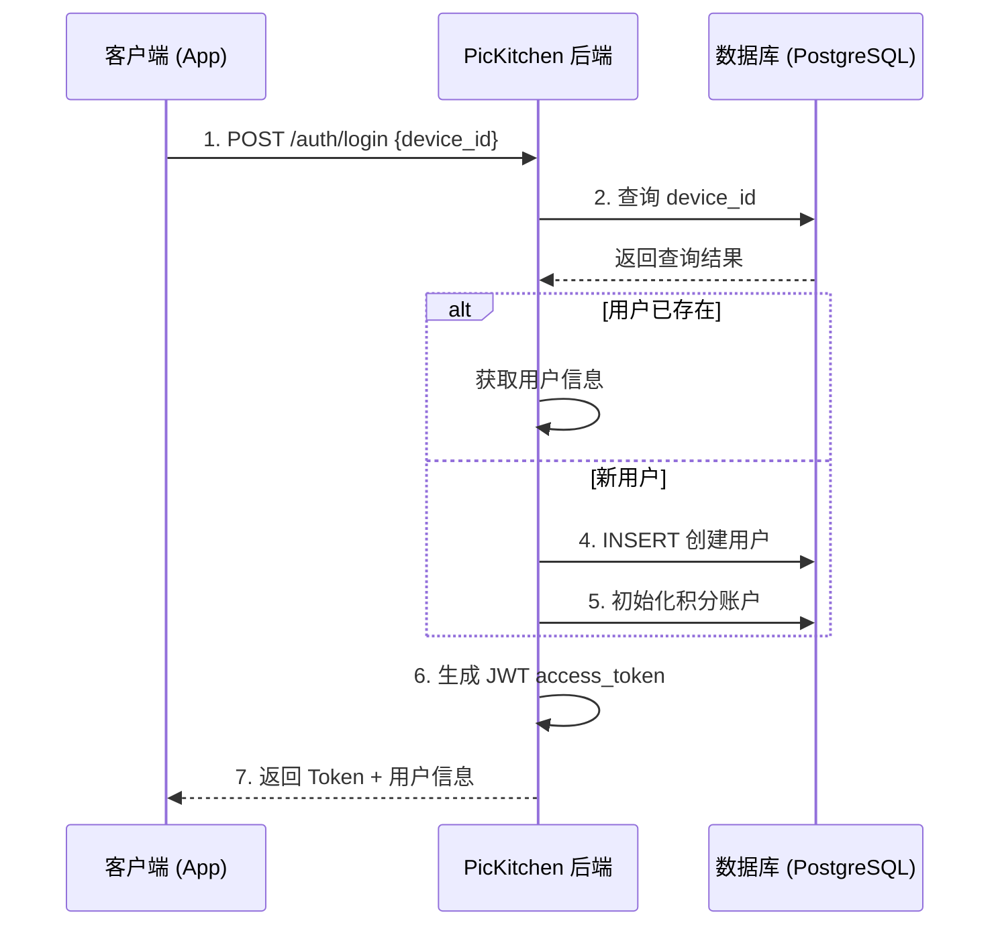
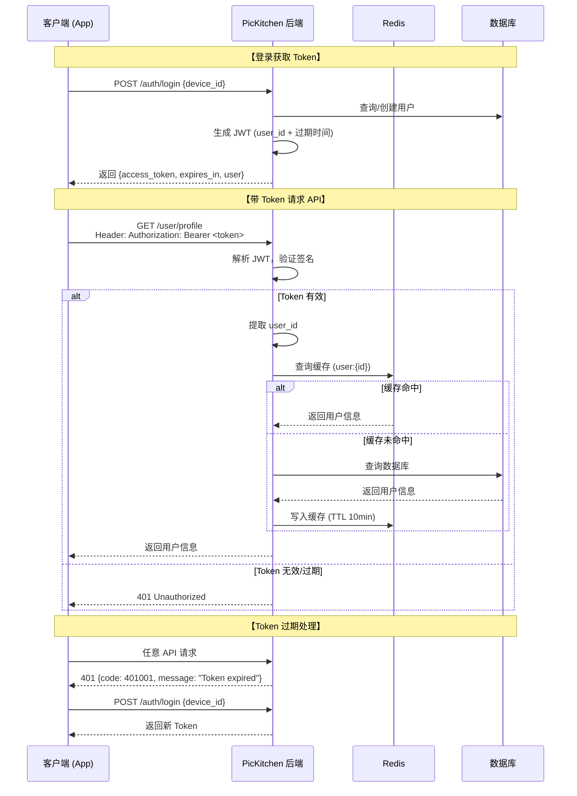
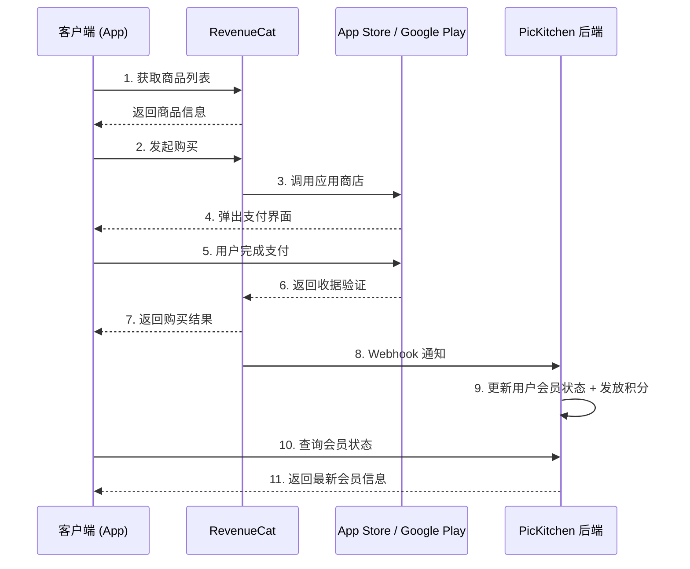
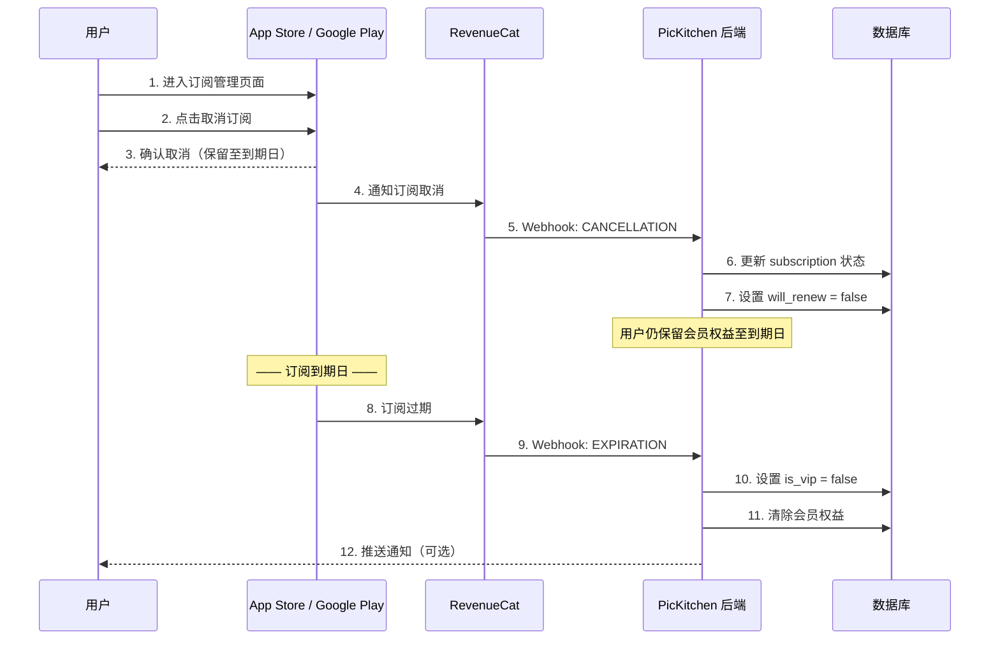
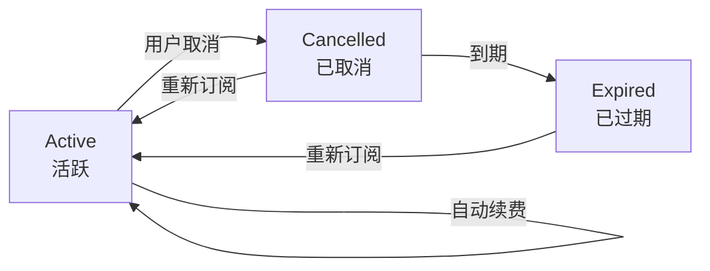
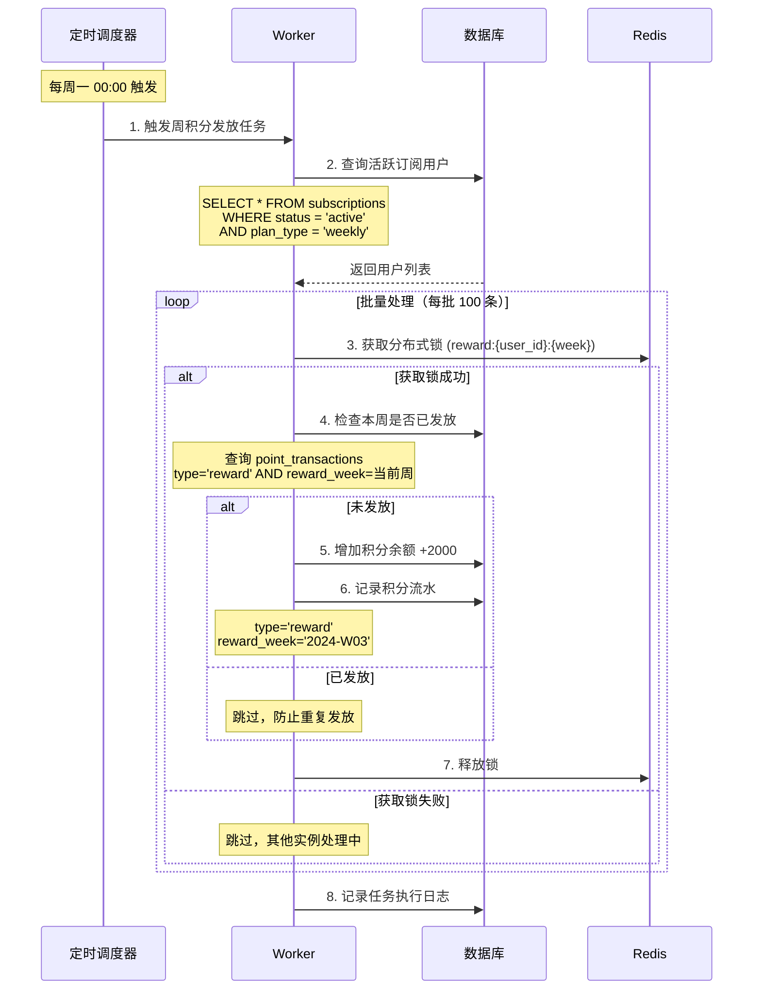
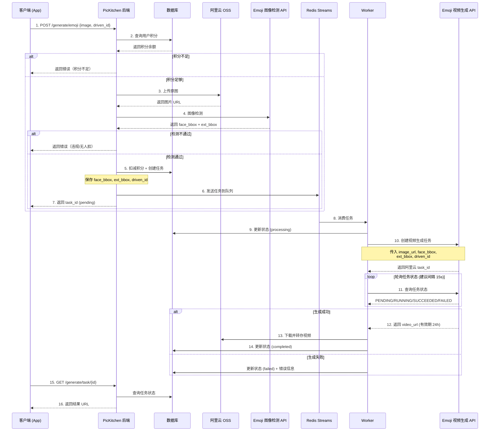
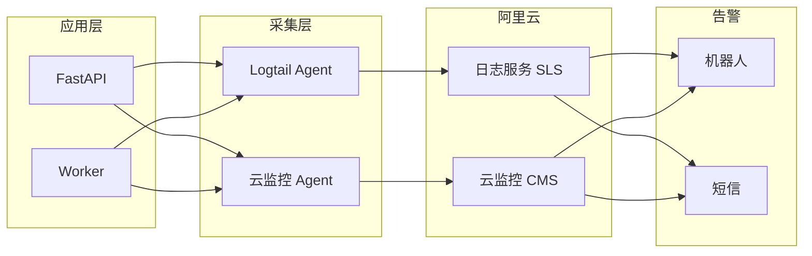

# PicKitchen 后端技术方案

## 一、项目概述

### 1.1 背景与需求

**产品定位：** PicKitchen 是一款基于 AI 的表情包生成工具，用户上传照片即可生成个性化表情包视频。

**目标用户：**

- 喜欢社交聊天、追求个性化表达的年轻用户
- 希望用自己/朋友照片制作趣味表情包的用户

**核心价值：**

- 一键生成：简化创作流程，降低使用门槛
- AI 驱动：利用阿里云 AI 能力实现高质量生成效果
- 多样风格：提供丰富的驱动模板，满足不同场景需求

**相关文档：**

- 需求文档：*（待补充 PRD 链接）*
- 设计稿：*（待补充设计稿链接）*

### 1.2 资源与依赖

**内部服务：**

- 无（当前为独立系统）

**外部服务：**

| 服务 | 用途 | 说明 |
| --- | --- | --- |
| 阿里云模型服务平台 | AI 生成能力 | Emoji 图像检测 + 视频生成 API |
| 阿里云 OSS | 对象存储 | 用户上传图片、生成结果存储 |
| RevenueCat | 订阅管理 | 统一管理 iOS/Android 订阅、Webhook 回调 |
| App Store / Google Play | 应用商店 | IAP 支付、订阅验证 |
| 阿里云日志服务 (SLS) | 日志存储 | API 访问日志、错误日志集中管理 |
| 阿里云云监控 | 监控告警 | 服务器指标、业务指标监控 |

---

## 二、技术架构概述

### 1.1 整体架构

采用前后端分离架构，后端提供 RESTful API 服务，部署在阿里云 ECS 上。

**系统架构图：**



### 1.2 技术栈选型

- **开发语言：** Python 3.11+
- **Web 框架：** FastAPI（高性能异步框架，支持自动 API 文档生成）
- **ORM：** SQLModel（结合 SQLAlchemy + Pydantic）
- **数据库：** PostgreSQL 15+（结构化数据）+ Redis 6.x（缓存、会话管理）
- **数据库驱动：** asyncpg（异步 PostgreSQL 驱动）
- **对象存储：** 阿里云 OSS
- **AI 服务：** 阿里云模型服务平台（Emoji 生成 API）
- **消息队列：** Redis Streams（异步任务处理，复用 Redis 实例）
- **Web 服务器：** Nginx（反向代理、负载均衡）
- **进程管理：** systemd
- **数据库迁移：** Alembic
- **配置中心：** Nacos 3.x（动态配置管理、服务发现）
- **订阅管理：** RevenueCat（统一管理 iOS/Android 订阅）

---

## 三、系统模块设计

### 2.1 用户模块

**功能：**

- 用户注册、登录（支持设备 ID / 邮箱 识别） **— TODO**
- 用户信息管理
- 会员状态管理

**用户注册/登录流程图：**



**特点说明：**

- 注册/登录：基于设备 ID 自动注册/登录，用户无感
- 首次使用即自动创建账户
- Token 过期后重新调用 login 接口刷新

**JWT Token 设计：**

```json
// Header
{
  "alg": "HS256",
  "typ": "JWT"
}
// Payload
{
  "sub": "1234567890123456",  // user_id (Snowflake ID)
  "iat": 1737187200,          // 签发时间
  "exp": 1737792000,          // 过期时间 (7天后)
  "type": "access"            // Token 类型
}
```

**Token 配置参数：**

| 参数 | 值 | 说明 |
| --- | --- | --- |
| ACCESS_TOKEN_EXPIRE | 7 天 | access_token 有效期 |
| ALGORITHM | HS256 | 签名算法 |
| SECRET_KEY | Nacos 配置 | 签名密钥（至少 32 位随机字符串） |

**Token 使用流程图：**



**客户端 Token 使用规范：**

1. **存储**：将 access_token 存储在本地安全存储（iOS Keychain / Android EncryptedSharedPreferences）
2. **携带**：每次 API 请求在 Header 中携带 `Authorization: Bearer <token>`
3. **过期处理**：收到 401 响应时，自动调用 `/auth/login` 获取新 Token
4. **预刷新**（可选）：在 Token 即将过期前（如剩余 1 天）主动刷新

**后端 Token 验证逻辑：**

**安全考量：**

- 仅使用 access_token，无 refresh_token（设备 ID 登录场景无需）
- Token 不存储敏感信息，仅包含 user_id
- 服务端不存储 Token，无状态验证
- SECRET_KEY 通过 Nacos 配置，定期轮换
- 数据表：`users`
    
    
    | 字段 | 类型 | 说明 |
    | --- | --- | --- |
    | id | BIGINT | 主键 |
    | device_id | VARCHAR(128) | 设备唯一标识 |
    | nickname | VARCHAR(64) | 昵称 |
    | is_vip | BOOLEAN | 是否会员 |
    | vip_type | ENUM | weekly / lifetime |
    | vip_expire_time | DATETIME | 会员过期时间 |
    | created_at | DATETIME | 创建时间 |
    | updated_at | DATETIME | 更新时间 |

**用户 ID 生成逻辑（Snowflake 算法）：**

使用 Snowflake 算法生成 64 位唯一 ID，内外部统一使用：

```
| 1 bit | 41 bits     | 10 bits    | 12 bits     |
| 符号位 | 时间戳 (ms)  | 机器 ID    | 序列号       |
```

**设计优势：**

- **单一 ID**：内外部统一使用，无需转换
- **时间有序**：ID 大致按生成时间递增，利于数据库索引
- **不可枚举**：无法通过 ID 推测用户数量或遍历用户
- **高性能**：本地生成，无需网络调用，每毫秒可生成 4096 个 ID

### 2.2 订阅与支付模块

**功能：**

- 通过 RevenueCat 统一管理 iOS/Android 订阅
- Webhook 接收订阅状态变更
- 积分包购买
- 会员权益发放

**RevenueCat 集成说明：**

- 客户端 SDK 处理购买流程
- 后端通过 Webhook 接收订阅事件（购买、续费、取消、过期等）
- 后端可通过 RevenueCat REST API 查询用户订阅状态
- 支持跨平台订阅状态同步

**订阅购买流程图：**



**订阅取消/退订流程图：**



**订阅状态流转图：**



- 数据表：`subscriptions`
    
    
    | 字段 | 类型 | 说明 |
    | --- | --- | --- |
    | id | BIGINT | 主键 |
    | user_id | BIGINT | 用户 ID |
    | rc_subscriber_id | VARCHAR(128) | RevenueCat Subscriber ID |
    | product_id | VARCHAR(64) | 订阅商品 ID |
    | plan_type | ENUM | weekly / lifetime |
    | status | ENUM | active / cancelled / expired |
    | will_renew | BOOLEAN | 是否自动续费 |
    | current_period_start | DATETIME | 当前订阅周期开始时间 |
    | current_period_end | DATETIME | 当前订阅周期结束时间 |
    | cancelled_at | DATETIME | 取消时间 |
    | created_at | DATETIME | 创建时间 |
    | updated_at | DATETIME | 更新时间 |
- 数据表：`orders`
    
    
    | 字段 | 类型 | 说明 |
    | --- | --- | --- |
    | id | BIGINT | 主键 |
    | user_id | BIGINT | 用户 ID |
    | order_no | VARCHAR(64) | 订单号（唯一） |
    | product_type | ENUM | points_pack / subscription |
    | product_id | VARCHAR(64) | 商品 ID |
    | quantity | INT | 购买数量（积分包用） |
    | amount | DECIMAL(10,2) | 订单金额 |
    | currency | VARCHAR(8) | 货币类型（USD / CNY） |
    | status | ENUM | pending / paid / failed / refunded |
    | payment_channel | VARCHAR(32) | 支付渠道（apple / google） |
    | transaction_id | VARCHAR(128) | 第三方交易 ID |
    | created_at | DATETIME | 创建时间 |
    | paid_at | DATETIME | 支付时间 |
    | updated_at | DATETIME | 更新时间 |

### 2.3 积分模块

**功能：**

- 积分余额查询
- 积分消耗（生成任务）
- 积分充值（购买积分包）
- 会员积分定期发放
- 数据表：`user_points`
    
    
    | 字段 | 类型 | 说明 |
    | --- | --- | --- |
    | id | BIGINT | 主键 |
    | user_id | BIGINT | 用户 ID |
    | balance | INT | 积分余额 |
    | updated_at | DATETIME | 更新时间 |
- 数据表：`point_transactions`
    
    
    | 字段 | 类型 | 说明 |
    | --- | --- | --- |
    | id | BIGINT | 主键 |
    | user_id | BIGINT | 用户 ID |
    | type | ENUM | consume / purchase / reward |
    | amount | INT | 变动数量 |
    | balance_after | INT | 变动后余额 |
    | task_type | VARCHAR(32) | 关联任务类型 |
    | order_id | VARCHAR(64) | 关联订单号 |
    | created_at | DATETIME | 创建时间 |

#### 会员周积分发放（定时任务）

**发放规则：**

- 周订阅会员：每周发放 **2000 积分**
- 发放时机：每周一 00:00 **UTC+0** 执行定时任务
- 发放条件：订阅状态为 `active` 且未过期
- 积分有效期：跟随订阅周期，订阅过期后剩余积分**保留可用**（也可按需调整为清零）
- **时区说明：** 面向海外市场，所有定时任务统一使用 **UTC+0** 时区，`reward_week` 字段也基于 UTC 周计算（ISO 8601 周编号）

**定时任务流程图：**



**幂等性控制：**

- `point_transactions` 表增加 `reward_week` 字段（VARCHAR(8)，格式如 `2024-W03`）
- 唯一约束：`UNIQUE(user_id, type, reward_week)` 防止同一周重复发放
- 分布式锁：`reward:\{user_id\}:\{week\}`，TTL 60 秒
- 数据表：`point_transactions` 补充字段
    
    
    | 字段 | 类型 | 说明 |
    | --- | --- | --- |
    | reward_week | VARCHAR(8) | 奖励所属周（如 2024-W03），仅 reward 类型使用 |

**Nacos 配置（pickitchen-points.json）：**

```json
{
  "weekly_reward": {
    "enabled": true,
    "amount": 2000,
    "cron": "0 0 0 * * 1",
    "timezone": "UTC"
  }
}
```

**Python 调度器时区配置示例（APScheduler）：**

```python
from apscheduler.schedulers.asyncio import AsyncIOScheduler
from apscheduler.triggers.cron import CronTrigger
import pytz

scheduler = AsyncIOScheduler(timezone=pytz.UTC)

scheduler.add_job(
    weekly_points_reward_task,
    CronTrigger(day_of_week='mon', hour=0, minute=0, timezone=pytz.UTC),
    id='weekly_points_reward'
)
```

**异常处理：**

- 任务执行失败时记录日志，不影响其他用户
- 支持手动触发补发（管理后台或脚本）
- 发放失败的用户记录到重试队列，下次任务执行时优先处理

### 2.4 内容生成模块  【这里的积分扣减逻辑需要确认下，检测扣不扣积分】

**功能：**

- 图片上传与检测
- 调用阿里云 Emoji API 生成表情包
- 异步任务处理
- 生成历史记录

**内容生成流程图：**



- 数据表：`emoji_tasks`
    
    
    | 字段 | 类型 | 说明 |
    | --- | --- | --- |
    | id | BIGINT | 主键 |
    | user_id | BIGINT | 用户 ID |
    | task_type | ENUM | emoji / avatar / pose |
    | source_image_url | VARCHAR(512) | 原图 OSS 地址 |
    | style_name | VARCHAR(64) | 风格名称 |
    | result_url | VARCHAR(512) | 结果 OSS 地址 |
    | status | ENUM | pending / processing / completed / failed |
    | points_cost | INT | 消耗积分 |
    | error_message | TEXT | 错误信息 |
    | created_at | DATETIME | 创建时间 |
    | completed_at | DATETIME | 完成时间 |

### 2.5 配置管理模块（Nacos）

**功能：**

- 应用配置管理（数据库连接、API 密钥等）
- 分类、风格配置管理
- Banner 配置
- 积分消耗配置（按任务类型）
- 会员积分奖励配置

**Nacos 配置分组：**

| Data ID | Group | 说明 |
| --- | --- | --- |
| pickitchen-app.yaml | DEFAULT_GROUP | 应用主配置（数据库、Redis、OSS 等） |
| pickitchen-styles.json | BUSINESS | 风格模板配置（支持动态更新） |
| pickitchen-points.json | BUSINESS | 积分规则配置 |
| pickitchen-banners.json | BUSINESS | Banner 配置 |

**配置监听：** 应用启动时从 Nacos 拉取配置，并监听配置变更实时更新（无需重启服务）

---

## 四、核心 API 设计

**基础约定：**

- 基础路径：`/api/v1`
- 认证方式：JWT Bearer Token（除登录接口外均需携带）
- 响应格式：`{"code": 0, "message": "success", "data": {...}`

### 4.1 认证相关

| 接口 | 方法 | 说明 | 认证 |
| --- | --- | --- | --- |
| /api/v1/auth/login | POST | 设备 ID 登录/注册，返回 access_token | 否 |
| /api/v1/auth/refresh | POST | 刷新 Token（可选） | 是 |

### 4.2 用户相关

| 接口 | 方法 | 说明 |
| --- | --- | --- |
| /api/v1/user/profile | GET | 获取用户信息（会员状态、积分余额等） |
| /api/v1/user/profile | PUT | 更新用户信息（昵称等） |

### 4.3 积分相关

| 接口 | 方法 | 说明 |
| --- | --- | --- |
| /api/v1/points/balance | GET | 获取积分余额 |
| /api/v1/points/transactions | GET | 获取积分交易记录（分页） |

### 4.4 Emoji 生成

| 接口 | 方法 | 说明 |
| --- | --- | --- |
| /api/v1/emoji/upload | POST | 上传图片到 OSS 【直接客户端上传？】 |
| /api/v1/emoji/detect | POST | 图像检测（人脸/历规），不扣积分 |
| /api/v1/emoji/create | POST | 创建生成任务（扣减积分 + 异步处理）
重新生成也走这个接口 |
| /api/v1/emoji/task/{task_id} | GET | 查询任务状态及结果 |
| /api/v1/emoji/history | GET | 获取生成历史记录（分页） |
| /api/v1/emoji/task/{task_id} | DELETE | 删除生成记录 |

**Emoji 生成完整流程：**

```
客户端调用顺序：
1. POST /emoji/upload      → 获取 image_url
2. POST /emoji/detect      → 验证图像是否合规（不扣积分）
3. POST /emoji/create      → 创建任务（扣积分）
4. GET  /emoji/task/{id}   → 轮询任务状态
```

### 4.5 订阅与支付

| 接口 | 方法 | 说明 |
| --- | --- | --- |
| /api/v1/subscription/status | GET | 查询用户订阅状态 |
| /api/v1/subscription/webhook | POST | RevenueCat Webhook 回调（订阅事件通知） |
| /api/v1/order/create | POST | 创建积分包订单 |
| /api/v1/order/{order_id} | GET | 查询订单详情 |
| /api/v1/order/list | GET | 获取订单列表（分页） |

Webhook 接口通过 RevenueCat 签名验证

### 4.6 配置相关

| 接口 | 方法 | 说明 |
| --- | --- | --- |
| /api/v1/config | GET | 获取全量配置（一次性下发） |

**响应示例：**

```json
{
  "code": 0,
  "data": {
    "banners": [
      {"id": 1, "image_url": "...", "link": "...", "sort": 1}
    ],
    "styles": [
      {
        "category": "搞怪",
        "templates": [
          {"driven_id": "emoji_001", "name": "吐舌头", "preview_url": "..."}
        ]
      }
    ],
    "points_rules": {
      "emoji": 10,
      "avatar": 20
    }
  }
}
```

**使用场景：** App 启动时调用一次，本地缓存配置

### 4.7 接口汇总

| 模块 | 接口数 | 备注 |
| --- | --- | --- |
| 认证 | 2 | 登录 / 刷新 Token |
| 用户 | 2 | 获取 / 更新个人信息 |
| 积分 | 2 | 余额 / 交易记录 |
| Emoji 生成 | 6 | 上传 / 检测 / 创建 / 查询 / 历史 / 删除 |
| 订阅与支付 | 5 | 订阅状态 / Webhook / 订单 CRUD |
| 配置 | 1 | 全量配置一次性下发 |
| **总计** | **18** |  |

---

## 五、部署架构

### 4.1 阿里云 ECS 配置建议

| 配置项 | 建议值 |
| --- | --- |
| 实例规格 | ecs.c6.xlarge（4核8G）起步 |
| 操作系统 | Ubuntu 22.04 LTS |
| 网络 | VPC 专有网络 |
| 存储 | 100GB ESSD 云盘 |

### 4.2 服务部署方式

采用 **systemd** 管理服务进程，包含：

- **pickitchen-api.service**：FastAPI 主服务（uvicorn，4 workers）
- **pickitchen-worker.service**：异步任务处理 Worker

配置通过 Nacos 统一管理，本地仅保留 Nacos 连接信息（`.env`）。

### 4.3 Nginx 反向代理

- 监听 80/443 端口
- 反向代理到本地 8000 端口
- 配置 SSL 证书（Let's Encrypt）
- 设置 client_max_body_size 限制上传大小

### 4.4 Nacos 3.x 部署

**部署方式：** 单机模式 + 内置嵌入式存储（初期）

**部署步骤：**

1. 下载 Nacos 3.x：`wget` [`](https://github.com/alibaba/nacos/releases/download/3.x.x/nacos-server-3.x.x.tar.gz)[https://github.com/alibaba/nacos/releases/download/3.x.x/nacos-server-3.x.x.tar.gz`](https://github.com/alibaba/nacos/releases/download/3.x.x/nacos-server-3.x.x.tar.gz`)
2. 解压到 `/opt/nacos`
3. 配置 `conf/`[`application.properties`](http://application.properties)：

```
server.port=8848
nacos.core.auth.enabled=true
nacos.core.auth.server.identity.key=pickitchen
nacos.core.auth.server.identity.value=<自定义密钥>
nacos.core.auth.plugin.nacos.token.secret.key=<Base64编码的密钥>
```

1. 启动：`sh bin/`[`startup.sh`](http://startup.sh) `-m standalone`
2. 配置 systemd 服务：`nacos.service`

**安全配置：**

- 开启鉴权（`nacos.core.auth.enabled=true`）
- 仅允许 VPC 内网访问 8848 端口
- 创建专用用户，避免使用默认的 nacos/nacos

**Python 客户端集成：**

```python
# requirements.txt
nacos-sdk-python>=2.0.0

# 
```

---

## 六、项目结构

---

## 七、安全防护方案

### 6.1 网络安全

**安全组配置：**

| 规则方向 | 端口 | 来源 | 说明 |
| --- | --- | --- | --- |
| 入站 | 80/443 | 0.0.0.0/0 | HTTP/HTTPS 访问 |
| 入站 | 22 | 特定 IP | SSH 管理（仅限内部 IP） |
| 入站 | 5432 | VPC 内网 | PostgreSQL（禁止公网访问） |
| 入站 | 6379 | VPC 内网 | Redis（禁止公网访问） |
| 入站 | 8848 | VPC 内网 | Nacos（禁止公网访问） |
| 出站 | 全部 | 0.0.0.0/0 | 允许访问外部服务 |

**VPC 网络隔离：**

- ECS、RDS、Redis 部署在同一 VPC 内
- 数据库仅允许 VPC 内网访问，不分配公网 IP
- 使用不同子网分离 Web 层和数据层

### 6.2 DDoS 防护

- **基础防护：** 启用阿里云 DDoS 基础防护（5Gbps 免费）
- **高防 IP：** 业务增长后可升级到 DDoS 高防 IP
- **流量清洗：** 配置流量清洗阈值，自动拦截异常流量

### 6.3 Web 应用防火墙 (WAF)    — ？？？要做吗？成本

**阿里云 WAF 配置：**

- 启用 SQL 注入防护
- 启用 XSS 攻击防护
- 配置 CC 攻击防护（请求频率限制）
- 启用恶意爹虫拦截
- 配置 IP 黑名单
- 添加地域封禁规则（可选，根据业务需要）

### 6.4 服务器安全加固

**SSH 安全：**

- 禁用 root 远程登录
- 禁用密码登录，仅允许密钥认证
- 修改默认 SSH 端口（可选）
- 安装 fail2ban 防止暴力破解

**系统安全：**

- 定期更新系统补丁（unattended-upgrades）
- 关闭不必要的服务和端口
- 配置 UFW 防火墙作为二次防护
- 设置文件权限，最小化运行用户权限

### 6.5 应用层安全

**API 安全：**

- JWT Token 鉴权，设置合理过期时间（7 天）
- Redis 实现多维度限流（IP / 用户 / 接口）
- 请求参数校验（Pydantic 自动校验）
- 响应数据脱敏（隐藏内部 ID、敏感字段）

**数据安全：**

- ORM 参数化查询防止 SQL 注入
- 数据库连接使用 SSL 加密
- Redis 设置密码认证
- OSS 启用服务端加密 (SSE)

**内容安全：**

- 阿里云内容安全 API（人脸检测、内容审核）
- 上传文件类型、大小限制
- 图片处理前进行格式验证

### 6.6 密钥与凭证管理

- 敏感信息统一存储在 Nacos 配置中心，不写入代码
- Nacos 开启鉴权，密钥配置加密存储
- 生产环境可结合阿里云密钥管理服务 (KMS)
- 定期轮换 API 密钥和数据库密码
- 不同环境使用不同的 Nacos 命名空间（dev / prod）

### 6.7 安全监控与告警

**日志审计：**

- 所有 API 请求记录访问日志（IP、用户、接口、状态码）
- 登录失败、异常操作单独记录
- 日志保存至阿里云日志服务 (SLS)，保留 90 天

**告警规则：**

| 告警项 | 阈值 | 动作 |
| --- | --- | --- |
| 登录失败次数 | 同 IP 5 分钟内 > 10 次 | 封禁 IP + 通知 |
| API 错误率 | > 5% | 钉钉/邮件告警 |
| CPU 使用率 | > 80% 持续 5 分钟 | 短信 + 钉钉告警 |
| DDoS 攻击 | 流量异常 | 自动清洗 + 通知 |
| 数据库连接数 | > 80% | 钉钉告警 |

### 6.8 应急响应预案

**攻击发生时：**

1. 确认攻击类型（DDoS / CC / 入侵）
2. 启用 WAF 高级防护模式
3. 必要时切换至 DDoS 高防 IP
4. 分析日志定位攻击源
5. 添加黑名单规则
6. 评估影响并记录事件报告

**数据泄露时：**

1. 立即轮换所有密钥和凭证
2. 排查泄露范围和原因
3. 修复漏洞并加强防护
4. 必要时通知受影响用户

### 6.2 性能优化

- **数据库：** 合理索引、读写分离、连接池
- **缓存：** Redis 缓存热点数据
- **异步处理：** 消息队列 + FastAPI 异步特性
- **CDN 加速：** OSS 绑定 CDN
- **监控告警：** 阿里云云监控、日志服务

---

## 八、运维与监控

### 8.1 日常运维操作

#### 服务管理命令

```bash
# API 服务
sudo systemctl start pickitchen-api      # 启动
sudo systemctl stop pickitchen-api       # 停止
sudo systemctl restart pickitchen-api    # 重启
sudo systemctl status pickitchen-api     # 查看状态

# Worker 服务
sudo systemctl start pickitchen-worker
sudo systemctl stop pickitchen-worker
sudo systemctl restart pickitchen-worker

# Nacos 服务
sudo systemctl start nacos
sudo systemctl stop nacos

# 查看服务日志
journalctl -u pickitchen-api -f          # 实时查看 API 日志
journalctl -u pickitchen-worker -f       # 实时查看 Worker 日志
journalctl -u pickitchen-api --since "1 hour ago"  # 查看最近1小时
```

#### systemd 服务配置示例

- pickitchen-api.service
    
    ```
    [Unit]
    Description=PicKitchen API Service
    After=
    ```
    
- pickitchen-worker.service
    
    ```
    [Unit]
    Description=PicKitchen Worker Service
    After=
    ```
    

#### 健康检查 API

**接口设计：** `GET /health`（无需认证）

```json
// 响应示例
{
  "status": "healthy",
  "timestamp": "2024-01-18T10:00:00Z",
  "components": {
    "database": {"status": "up", "latency_ms": 5},
    "redis": {"status": "up", "latency_ms": 2},
    "nacos": {"status": "up"}
  },
  "version": "1.0.0"
}
```

**健康检查脚本：**

```bash
#!/bin/bash
# /opt/pickitchen-backend/scripts/
```

---

### 8.2 日志管理

#### 日志分类

| 日志类型 | 文件路径 | 内容 | 保留策略 |
| --- | --- | --- | --- |
| API 访问日志 | /var/log/pickitchen/access.log | 请求 IP、路径、状态码、耗时 | 30 天 |
| 应用日志 | /var/log/pickitchen/app.log | 业务逻辑、调试信息 | 30 天 |
| 错误日志 | /var/log/pickitchen/error.log | 异常堆栈、错误详情 | 90 天 |
| Worker 日志 | /var/log/pickitchen/worker.log | 任务处理、AI 调用 | 30 天 |

#### Python Logging 配置

#### 阿里云 SLS 采集配置

---

### 8.3 监控系统配置

#### 监控架构图



#### 监控指标详情

| 指标类型 | 指标名 | 采集方式 | 告警阈值 |
| --- | --- | --- | --- |
| 系统指标 | CPU 使用率 | 云监控 Agent | > 80% 持续 5 分钟 |
| 系统指标 | 内存使用率 | 云监控 Agent | > 85% |
| 系统指标 | 磁盘使用率 | 云监控 Agent | > 80% |
| API 指标 | 请求量 (QPS) | SLS 统计 | 仅监控，无告警 |
| API 指标 | 平均响应时间 | SLS 统计 | > 2s |
| API 指标 | 错误率 (5xx) | SLS 统计 | > 5% |
| 数据库 | 连接数 | RDS 监控 | > 80% 最大连接数 |
| 数据库 | 慢查询数 | RDS 监控 | > 10 次/分钟 |
| Redis | 内存使用率 | Redis 监控 | > 80% |
| Redis | 队列积压 | 自定义上报 | > 1000 条 |
| 业务指标 | 任务成功率 | SLS 统计 | < 95% |

#### 自定义业务指标上报

---

### 8.4 告警通知配置

#### 告警渠道

| 告警级别 | 通知渠道 | 响应时间 | 适用场景 |
| --- | --- | --- | --- |
| P0 严重 | 短信 + 电话 +飞书 | 5 分钟内 | 服务不可用、数据库宕机 |
| P1 重要 | 短信 + 飞书 | 15 分钟内 | 错误率飙升、性能严重下降 |
| P2 一般 | 飞书 | 1 小时内 | 磁盘空间预警、慢查询增多 |
| P3 提醒 | 飞书 | 下个工作日 | 日常统计、趋势预警 |
|  |  |  |  |

#### 机器人配置

---

### 8.6 备份与恢复

#### 备份策略

| 备份对象 | 备份方式 | 频率 | 保留周期 | 存储位置 |
| --- | --- | --- | --- | --- |
| PostgreSQL | RDS 自动备份 | 每日全量 + 实时增量 | 7 天 | 阿里云 RDS |
| Redis | RDB + AOF | 每小时 RDB | 3 天 | 阿里云 Redis |
| Nacos 配置 | 手动导出 + 脚本 | 每周 / 变更后 | 30 天 | OSS |

#### 数据恢复流程

**PostgreSQL 恢复：**

```bash
# 1. 从 RDS 控制台下载备份或克隆实例
# 2. 恢复到指定时间点（PITR）
#    RDS 控制台 → 备份恢复 → 恢复到任意时间点

# 3. 或使用 pg_restore 恢复本地备份
pg_restore -h 
```

**Nacos 配置恢复：**

```bash
# 从 OSS 下载配置备份
ossutil cp oss://pickitchen-backup/nacos/
```

---

## 九、开发与部署流程

### 8.1 开发环境

1. 克隆代码仓库
2. 创建 Python 虚拟环境
3. 安装依赖（requirements.txt）
4. 本地启动 Nacos（Docker 或单机模式）
5. 配置 `.env` 指向本地 Nacos
6. 运行 Alembic 数据库迁移
7. 启动 uvicorn 开发服务器

### 8.2 生产环境部署

1. 安装系统依赖（Python 3.11、PostgreSQL、Redis、Nginx、JDK 17+）
2. 部署并配置 Nacos 3.x（参考 4.4 节）
3. 在 Nacos 中创建配置（pickitchen-app.yaml 等）
4. 配置 PostgreSQL 数据库和用户
5. 部署应用代码到 /opt/pickitchen-backend
6. 创建虚拟环境并安装依赖
7. 配置 `.env` 指向 Nacos 地址
8. 运行数据库迁移
9. 配置 systemd 服务并启动
10. 配置 Nginx 反向代理
11. 申请 SSL 证书

### 8.3 CI/CD 流程

- 代码提交 → GitHub Actions 自动测试
- 测试通过 → SSH 到服务器拉取最新代码
- 运行数据库迁移 → 重启 systemd 服务

---

## 十、成本估算

### 9.1 阿里云资源

| 资源 | 规格 | 预估费用 |
| --- | --- | --- |
| ECS | ecs.c6.xlarge（4核8G） | ¥400/月 |
| RDS PostgreSQL | 4核8G | ¥500/月 |
| Redis | 1GB | ¥100/月 |
| OSS | 按量 | ¥0.12/GB/月 + 流量 |
| 带宽 | 5M | ¥100/月 |
| AI API | 按次 | 按实际使用量 |

**预估初期总成本：** ¥1400-1800/月（不含 AI API 调用）

### 9.2 优化建议

- 初期可使用单 ECS 部署所有服务降低成本
- 使用阿里云抢占式实例
- OSS 配置生命周期规则自动归档
- 根据负载动态调整资源

---

## 十一、后续迭代规划

### 10.1 短期优化（1-2 个月）

- 完善监控告警体系
- 优化 AI 生成效果和速度
- 支持批量生成功能
- 增加用户反馈机制

### 10.2 中期规划（3-6 个月）

- 支持视频生成功能
- 扩展更多 AI 能力（Voice、Music）
- 微服务化改造
- 多地域部署

### 10.3 长期规划（6-12 个月）

- 自建 AI 模型训练平台
- 支持用户自定义训练模型
- 社区功能（作品分享、互动）
- 国际化支持

---

## 十二、开发排期

| 模块 | 工作内容 | 工期 | 交付物 | 备注 |
| --- | --- | --- | --- | --- |
| 基础框架 | • FastAPI 项目结构
• PostgreSQL + Redis 连接
• Nacos 配置集成
• Alembic 迁移框架
• 日志 / 异常处理 | 1天 | 可运行的基础项目 |  |
| 用户模块 | • 设备 ID 登录/注册
• JWT Token 生成/验证
• 用户信息 CRUD
• 会员状态管理 | 1 天 | 登录 API 可联调 |  |
| 积分模块 | • 积分余额查询
• 积分变动记录
• 积分扣减/充值逻辑 | 0.5天 | 积分 API 可联调 |  |
| 内容生成模块 | • 图片上传到 OSS
• Emoji 图像检测集成
• 任务创建 + Redis Streams
• Worker 异步处理
• 视频生成 API 集成
• 生成历史记录 | 1 天 | Emoji 生成全流程走通 |  |
| 订阅与支付 | • RevenueCat Webhook 集成
• 订阅状态同步
• 订单 CRUD
• 会员权益发放 | 1 天 | 订阅流程可联调 |  |
| 配置模块 | • 全量配置下发 API
• Nacos 配置监听 | 0.5天 | 配置 API 可用 |  |
| 联调测试 | • 全流程联调
• Bug 修复
• 性能优化
• 接口文档完善 | 1 天 | 联调通过，API 文档 |  |
| 部署上线 | • ECS 环境搭建
• Nginx + SSL 配置
• systemd 服务配置
• SLS 日志采集
• 云监控告警配置
• 灰度发布 | 1 天 | 生产环境上线 |  |

# 参考文档

[阿里云**图生表情包视频-表情包Emoji参考文档**](https://help.aliyun.com/zh/model-studio/emoji-quick-start/)